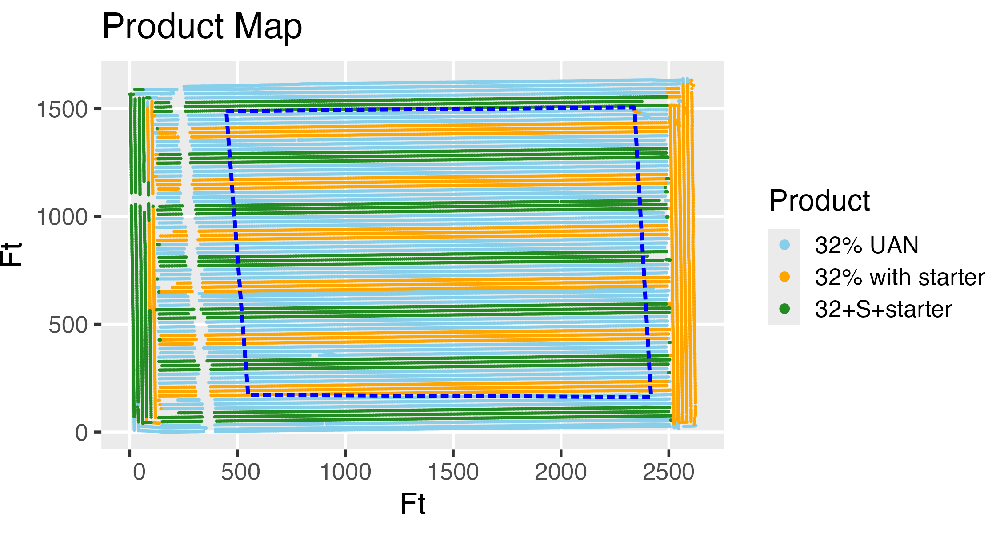

 This code reads a combine yield monitor shape file and does some basic analysis on the three different planting-time fertilizer treatments recorded in that yield data.  Analysis is easy since the operator got the planting-time fertilizer application data loaded up where the combine yield monitor could incorporate it into the yield monitor output.  (Getting things set up this way is nontrivial.)  You can exclude field edges and waterways from the study, either interactively drawing a polygon around the region of interest or reading one from a shape file.
<!--  -->

  
  
  

