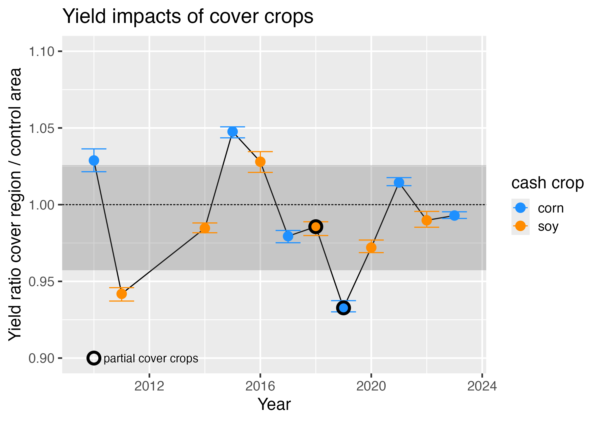
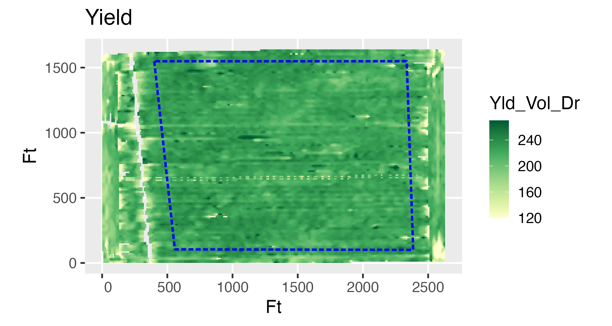
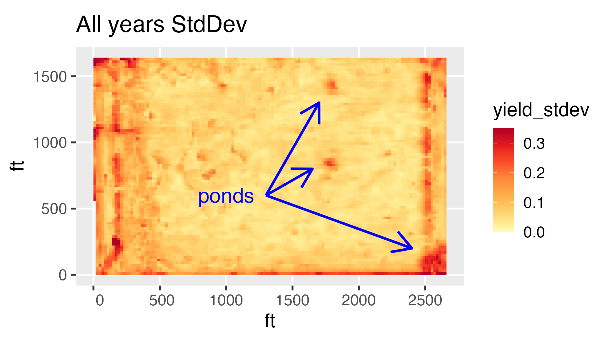

These are some scripts that I have written for analyzing our farm data.
- [Cover crop yield impacts](#cover-crop-yield-impacts)
- [Strip till in cover crops](#strip-till-in-cover-crops)
- [Starter fertilizer experiment](#starter-fertilizer-experiment)
- [Stacked yield rasters](#stacked-yield-rasters)

## Cover Crop Yield Impacts

We started experimenting with cover crops in about 2014.  How much, if any, do they impact the yields of the subsequent cash crop?  We have some trials in which we planted cover crops on a part of a field, so we can make the comparison.  The code NDVI+yield.R shows some of this analysis.

For context, the code first plots the elevation and soil type map of the field.  We plot some NDVI images to show the location of the cover crops and we plot the (normalized) yield maps from later that fall.  Then we go back and look at a dozen years' worth of yield data from that field; we compute the ratios of the yields in the cover crop area to the yields in the rest of the field.  Realistic uncertainties in the yield ratios come from the years when there was no treatment difference between the two areas -- that's the darker grey bar in the second figure.

The figures show this analysis for one field which had partial cover crops in 2018 and 2019.  The cover crop was cereal rye, which was drilled in the previous fall after harvest.  We plant green into standing rye, usually as the rye is flowering, and then terminate it.  In this case we found no significant yield impact on the soybeans in 2018 (cover area / control area = 0.99 $\pm$ 0.03), but we did find a modestly significant yield impact on the corn in 2019 (0.93 $\pm$ 0.03).  Since that time we have not used cereal rye before corn; we have used a mix of species including oats, barley, brassicas, and clovers.  In 2023/2024 we trialed more than a dozen cover crop species including camelina, flax, several clovers, and hairy vetch.  Stay tuned for comments on their yield impacts!

## Strip Till in Cover Crops

The code strips_experiment.R carries out the analysis for an experiment using strip-till in
our cover crops.  We wanted to know whether clearing some strips for the subsequent
corn crop would significantly affect the biomass of the cover and the cash crops,
and ultimately the corn yield.  This code plots NDVI images and histograms for the
regions with the cleared strips and the control regions without strips.
Older Sentinel-2 images are registered to a more recent image that seems to have
better coordinates.
In April (prime time for the cover crops to be putting on biomass) the regions
with cleared strips have about 80% as much biomass as the control regions.  The corn was planted in mid-May.  In
June, the corn in strip-tilled regions has 5% to 20% more biomass than the corn
in the control regions.
The cover crops in this experiment were a mix of barley, oats, 
several brassica species and crimson clover; the field shown in these figures was seeded with a drone in September, into standing beans during leaf drop (~ R7).
Harvest data will be coming soon.

## Starter Fertilizer Experiment 
 
The code in starter_vs_yield_2019.R reads a combine yield monitor shape file and does some basic analysis on the three different planting-time fertilizer treatments recorded in that yield data.  Analysis is easy since the operator got the planting-time fertilizer application data loaded up where the combine yield monitor could incorporate it into the yield monitor output.  (Getting things set up this way is nontrivial.)  You can exclude field edges and waterways from the study, either interactively drawing a polygon around the region of interest or reading one from a shape file.

The three treatments in this experiment were applied with a strip-till bar a day or so prior to planting corn.  All areas were treated with UAN 32%.  Some areas had in addition a 7-22-5 liquid as a starter and some had the 32%, starter, and ATS.  In this trial the starter produced a yield gain of about 3 bu/ac and the ATS gave an additional 2 bu/ac.  It's impossible to see those gains in the yield data until you make the histograms.  This is food-grade non-GMO white corn in east central IL. 

## Stacked Yield Rasters 

Our collections of combine yield monitor data allow some time-series analysis of yield variability at different locations in a field.  Areas with low and/or unstable yields may not be economic to farm; see, e.g., [Fowler et al 2024](https://www.nature.com/articles/s41598-024-51155-y).  I carried out this kind of analysis on our fields, where we have 12 to 14 years worth of yield maps.  The code yield_raster_analysis.R plots the yield maps and computes the yield standard deviation map.

In our case, areas of high variability turn out to be the field ends, waterways, and some ponds that we already knew about.  Further quantitative analysis would reveal the probability of making or losing money on those areas.

<!-- comment 

  
  
  

consider thumbnail 
-->
